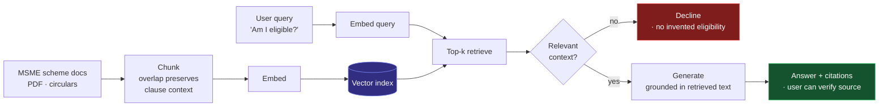

<div align="center">


<a href="https://shivaganesht.vercel.app">
  
</a>

<br/>

[](https://shivaganesht.vercel.app)
[](https://linkedin.com/in/shivaganesht)
[](mailto:shivaganesht@icloud.com)
[](https://matrixo.in)


</div>

---

## About

```python
from dataclasses import dataclass

@dataclass(frozen=True)
class Engineer:
    name:     str = "Shiva Ganesh Talikota"
    role:     str = "Product Development Engineer @ matriXO"
    base:     str = "Hyderabad, IN (UTC+05:30)"
    degree:   str = "B.Tech CSE, AI & ML — KPRIT, 2022-2026"
    ships:    tuple = ("retrieval systems", "agentic pipelines", "Next.js products")
    depth:    tuple = ("Python", "TypeScript", "PyTorch", "Node.js")
    open_to:  str = "SWE / AI-platform / product-engineering roles, 2026"

    def __str__(self) -> str:
        return f"{self.name} — {self.role}"
```

I work on the product side of applied AI: taking a model or a retrieval pipeline that works in a notebook and turning it into something with a URL, auth, error states, and a person on the other end using it. Most of my time goes to **matriXO**, an EdTech platform that maps what students actually learn in college against what roles actually ask for, and closes the gap with targeted recommendations.

The rest goes to retrieval systems. I care about the unglamorous parts — chunking strategy, whether the retriever surfaced the right passage, and whether the answer cites something a user can verify. A confident wrong answer is worse than no answer, especially in compliance and education.

I also run **[@stable.speaks](https://instagram.com/stable.speaks)** (44K+), where I explain AI and career tooling to students. Teaching a concept to 44,000 people who will call you out is a fast way to find the holes in your own understanding.

<div align="center">


</div>

---

## Systems I've Built

<table>
<tr>
<th align="left" width="18%">Project</th>
<th align="left" width="30%">Problem</th>
<th align="left" width="34%">How I approached it</th>
<th align="left" width="18%">Stack</th>
</tr>

<tr>
<td valign="top">

**matriXO**<br/>
`in production`<br/>
[matrixo.in](https://matrixo.in)

</td>
<td valign="top">College curricula and hiring requirements drift apart. Students find out at placement season, which is far too late to act on.</td>
<td valign="top">Model coursework and job descriptions in the same skill space, diff them per student, and recommend the shortest path across the gap. Product surface is a Next.js app over a Node API, with the scoring/recommendation work isolated in a Python service so it can change without redeploying the frontend.</td>
<td valign="top">

`Next.js` `Node.js`<br/>`Python` `MongoDB`<br/>`Vercel`

</td>
</tr>

<tr>
<td valign="top">

**pAIr**<br/>
`Code Unnati Marathon 4.0`<br/>
[demo](https://pair-code-unnati-proj.vercel.app) · [code](https://github.com/shivaganeshtalikota/pAIr-764)

</td>
<td valign="top">An MSME owner cannot read 400 pages of scheme documentation to find the three subsidies they qualify for — and a hallucinated eligibility answer costs them a rejected application.</td>
<td valign="top">RAG over the government scheme corpus rather than a fine-tune, so the source of every claim stays inspectable. Documents chunked with overlap to survive clause boundaries, embedded into a vector index, top-<em>k</em> retrieved per query, and generation constrained to the retrieved context with citations attached. If retrieval returns nothing relevant, the system says so instead of improvising.</td>
<td valign="top">

`Python` `RAG`<br/>`embeddings`<br/>`Next.js` `Vercel`

</td>
</tr>

<tr>
<td valign="top">

**Amazon ML Challenge**<br/>
`competition`

</td>
<td valign="top">Extract structured entity values — weight, volume, dimensions — directly from raw product listing images at catalogue scale.</td>
<td valign="top">Two-stage pipeline: a vision pass to localise and read text off the packaging, then a unit-aware parser that normalises every extracted value to canonical units. The parser mattered more than the model — "500 g", "0.5kg" and "500gm" are the same fact, and scoring punished every disagreement.</td>
<td valign="top">

`PyTorch` `OpenCV`<br/>`Python`

</td>
</tr>

<tr>
<td valign="top">

**PropChain**<br/>
`prototype`

</td>
<td valign="top">Real-estate investment has a floor price that excludes most people. Fractional ownership needs a trustworthy ledger of who owns what share.</td>
<td valign="top">Tokenised property equity as transferable on-chain units, with ownership and transfer logic in Solidity contracts and a Hardhat local chain for tests. Deliberately still a prototype — the contract surface needs an audit before it touches anything real, and I would rather say that than ship it.</td>
<td valign="top">

`Solidity` `Hardhat`<br/>`Web3.js` `React`

</td>
</tr>

<tr>
<td valign="top">

**Psypher Bot**<br/>
`research`

</td>
<td valign="top">Support conversations need to react to how someone is writing, not just what they asked.</td>
<td valign="top">Sentiment and intent classification over each user turn, conditioning which response strategy the bot selects. Built explicitly as a research artefact, not a clinical tool — that boundary is a design constraint, not a disclaimer.</td>
<td valign="top">

`Python` `NLTK`<br/>`TensorFlow`

</td>
</tr>

<tr>
<td valign="top">

**Nutri Advice**<br/>
`MVP`

</td>
<td valign="top">Generic nutrition guidance ignores individual constraints, so nobody follows it.</td>
<td valign="top">Recommendation over a nutrient-profile model with user constraints as hard filters, wrapped in a React Native client so it lives where people actually make food decisions.</td>
<td valign="top">

`scikit-learn`<br/>`React Native`

</td>
</tr>
</table>

<details>
<summary><b>Experiments, workshops &amp; hackathon builds</b></summary>

<br/>

| Project | What it is | Stack | Link |
|---|---|---|---|
| **agentic-ai-workshop-avn** | Teaching material from an Agentic AI workshop I ran — tool-calling loops built up from scratch | `Python` | [Repo](https://github.com/shivaganeshtalikota/agentic-ai-workshop-avn) |
| **scanseqjs** | Browser-side sequence scanning — kept the work off the server entirely | `JavaScript` | [Live](https://scanseqjs.vercel.app) |
| **infinova-hackathon** | Hackathon build, shipped inside the time box | `JavaScript` | [Live](https://infinova-hackathon.vercel.app) |
| **matrixo-website-deployment** | matriXO Web Dev Internship — technical evaluation R1 | `TypeScript` | [Live](https://matrixo-website-deployment.vercel.app) |
| **THK-Website** | Client site, spec to deploy | `JavaScript` | [Live](https://talikotaharikrishna.vercel.app) |
| **snake-game** | Collision detection and a game loop, written for fun | `JavaScript` | [Play](https://snake-game-beige-mu.vercel.app) |

</details>

---

## How pAIr Works

The retrieval path is where the engineering decisions live, so here it is end to end:



The branch at `G` is the whole point. Anything that ships an eligibility answer to a small business owner needs a path where it refuses, and the citation trail exists so the user never has to take the model's word for it.

---

## Tech

<div align="center">

**Ship with these regularly**


**Working knowledge — used on real projects, still deepening**


**Concepts I work in**

`RAG` · `vector search & embeddings` · `agentic tool-calling loops` · `transformers & attention` · `recommender systems` · `computer vision pipelines` · `REST API design` · `CI/CD`

</div>

---

## Experience

| When | Role | What it involved |
|---|---|---|
| **2024 – Present** | **Product Development Engineer** — matriXO, Hyderabad | Own the product surface end to end: architecture, Next.js/Node build-out, the Python recommendation service, and release. |
| **2025** | **Core Team** — CSR Summit 2025 | Operations for a 1000+ attendee summit — logistics, scheduling, on-day execution. |
| **2024** | **Speaker** — T-Hub Hyderabad | Talk on EdTech systems to 200+ founders and students. |
| **2023 – Present** | **Creator** — [@stable.speaks](https://instagram.com/stable.speaks) | 44.1K+ following. AI tooling and career engineering, explained for students. |
| — | **Intern** — Student Tribe · Ex-**TurboHire** · **Crowdsource by Google India** | Product and data work across hiring tech and open data collection. |
| **2022 – 2026** | **B.Tech CSE (AI &amp; ML)** — KPRIT, Hyderabad | Coursework in ML, DL, DSA, systems. |

Also building **OSSEB**.

---

## GitHub

<div align="center">

<!--
  NOTE ON THESE WIDGETS
  github-readme-stats.vercel.app (the default public instance) returns 503 under
  rate limiting, which is why these cards were showing as broken images. The URLs
  below point at a working deployment.

  PERMANENT FIX (~5 min, zero cost): deploy your own instance —
    1. Fork github.com/anuraghazra/github-readme-stats
    2. Import the fork at vercel.com/new
    3. Add env var PAT_1 = a GitHub personal access token (public_repo scope)
    4. Replace the host below with your own <your-app>.vercel.app
  A self-hosted instance uses your own rate limit and will not go down with the
  shared one.

  Two widgets were removed rather than left to break intermittently:
    - github-profile-trophy.vercel.app  -> returns HTTP 402 (billing lapsed)
    - streak-stats.demolab.com          -> flaps between 200 and 503
  The activity graph below already shows consistency, and it is reliable.
-->


<br/><br/>


</div>

---

## What I'm Working Through Next

Things currently open on my desk, not a curriculum:

- **Evaluating retrieval, not vibes** — building a labelled question set for pAIr so retrieval quality is a number that moves, instead of a judgement call after five manual queries.
- **Agentic loops that fail well** — tool-calling agents are easy to demo and hard to make recover from a bad tool response. Working on retry and fallback behaviour that does not spiral.
- **Serving models cheaply** — batching, caching and quantisation, because inference cost is a product constraint for a student-facing platform, not an implementation detail.
- **Reading** — the attention and retrieval literature, and other people's production post-mortems, which teach more per page than most papers.

---

## Open To

**Roles** — Product Development Engineer · Software Engineer (Full-Stack / AI-Platform) · Applied ML Engineer

**Available** — internships and part-time now · full-time from mid-2026 (graduating B.Tech CSE, AI & ML)

**Location** — Hyderabad · remote · open to relocating within India

**What I bring on day one** — shipping Next.js and Node products, Python services, retrieval systems that are honest about what they do not know, and the habit of finishing things and putting them in front of users.

If you are hiring for any of that, or you want a second pair of hands on an AI product, **[email me](mailto:shivaganesht@icloud.com)** or **[reach me on LinkedIn](https://linkedin.com/in/shivaganesht)**. I reply to everything.

---

<details>
<summary><b>Certifications</b></summary>

<br/>

| Certification | Issuer | Year |
|---|---|---|
| Google Cloud Arcade Program | Google Cloud | 2024 |
| Introduction to MongoDB | MongoDB University | 2024 |
| Cybersecurity Awareness | Industry | 2024 |
| Introduction to Graphic Design | Coursera | 2023 |

</details>

<details>
<summary><b>About this account</b></summary>

<br/>

My earlier account **[@shivaganesht](https://github.com/shivaganesht)** — which held 55+ repositories — was suspended without a stated reason, and I have an open case with GitHub Support to restore it. Active work lives here in the meantime, and older projects are being migrated across. If you have a route to escalate it, I would genuinely appreciate the help: [shivaganesht@icloud.com](mailto:shivaganesht@icloud.com).

</details>

---

<div align="center">

[](https://shivaganesht.vercel.app)
[](https://linkedin.com/in/shivaganesht)
[](https://instagram.com/stable.speaks)
[](https://www.geeksforgeeks.org/user/shivaganesht/)
[](mailto:shivaganesht@icloud.com)

<br/>

<sub>Building from Hyderabad, India 🇮🇳</sub>


</div>
